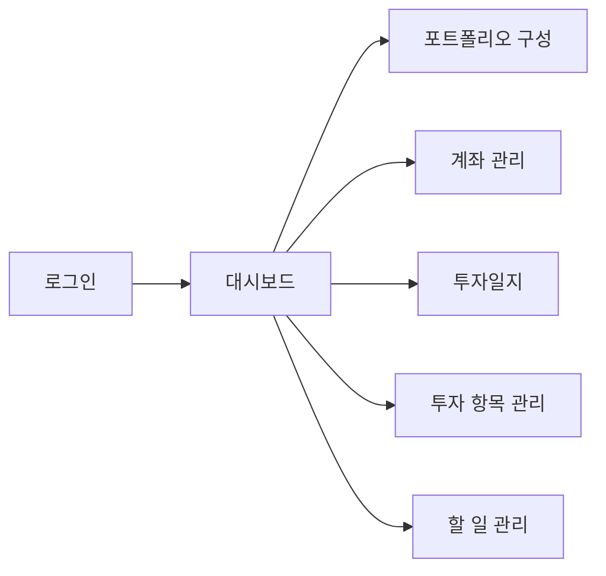
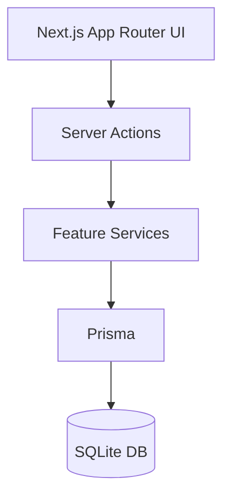
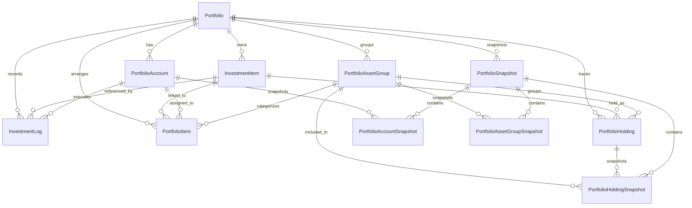
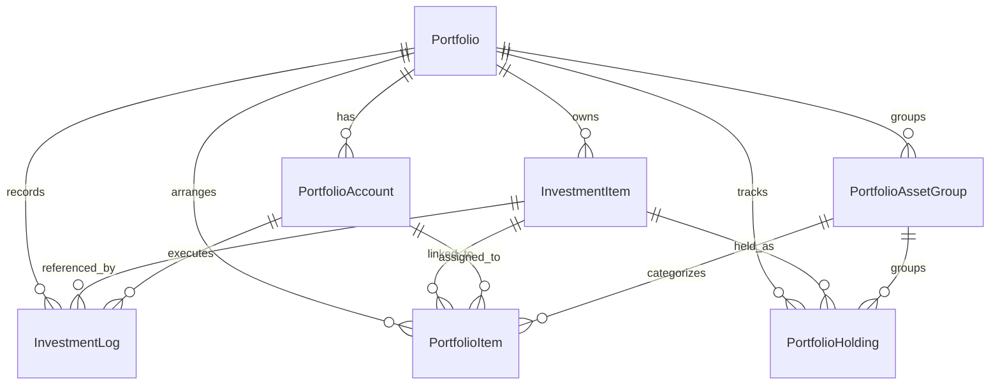
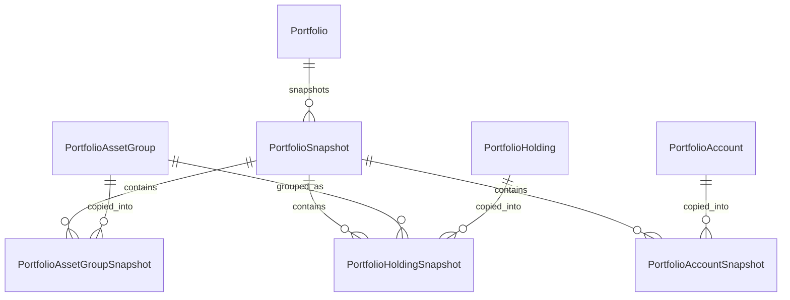

# Architecture

이 문서는 프로젝트 구조와 주요 흐름을 Mermaid 다이어그램으로 정리하는 기본 문서입니다.

## App Flow

## Data Flow

## DB Architecture

### Portfolio Management Domain

### Snapshot Domain

### Entity Notes

- `Portfolio`: 투자 관리의 최상위 집계 단위이며 계좌, 자산군, 종목, 스냅샷의 기준이 됩니다.
- `InvestmentItem`: 종목 마스터 데이터입니다. 코드, 거래소, 통화, 카테고리 같은 메타데이터를 보관합니다.
- `InvestmentLog`: 매수/매도 거래 기록입니다. 포트폴리오, 계좌, 종목과 느슨하게 연결되어 과거 이력을 유지합니다.
- `PortfolioAccount`: 증권사 계좌 또는 관리 계정 단위입니다. 계좌 현금 잔고와 연결 항목의 기준 정보를 함께 관리합니다.
- `PortfolioAssetGroup`: 자산 배분 그룹입니다. 목표 비중과 정렬 순서를 가집니다.
- `PortfolioItem`: 현재 화면에서 관리하는 포트폴리오 편성 항목입니다. 계좌, 자산군, 종목 마스터와 선택적으로 연결됩니다.
- `PortfolioHolding`: 포트폴리오 내 실제 보유 종목 상태입니다. `Portfolio + InvestmentItem` 조합이 유일합니다.
- `PortfolioSnapshot`: 특정 일자의 포트폴리오 평가 스냅샷 헤더입니다.
- `PortfolioAssetGroupSnapshot`, `PortfolioHoldingSnapshot`, `PortfolioAccountSnapshot`: 스냅샷 시점의 자산군/보유종목/계좌별 집계값을 저장합니다.
- `Todo`, `AppSettings`: 투자 데이터와 분리된 보조 도메인 테이블입니다. 각각 할 일 관리와 앱 브랜딩/대시보드 설정을 담당합니다.

### Domain Summary

- 운영 도메인(`Portfolio`, `InvestmentItem`, `PortfolioAccount`, `PortfolioAssetGroup`, `PortfolioItem`, `PortfolioHolding`, `InvestmentLog`)은 현재 포트폴리오 상태와 거래 입력을 관리합니다.
- 스냅샷 도메인(`PortfolioSnapshot` 및 하위 snapshot 테이블)은 특정 시점의 평가 금액과 비중을 이력으로 고정합니다.
- `PortfolioItem`은 화면 편집 중심의 편성 엔터티이고, `PortfolioHolding`은 실제 보유 상태 중심 엔터티라는 점이 역할상 가장 큰 차이입니다.

## Notes

- 화면 흐름은 필요에 따라 page 단위 또는 feature 단위로 세분화합니다.
- 구조도는 `flowchart`, `sequenceDiagram`, `erDiagram` 위주로 확장하는 것을 권장합니다.
